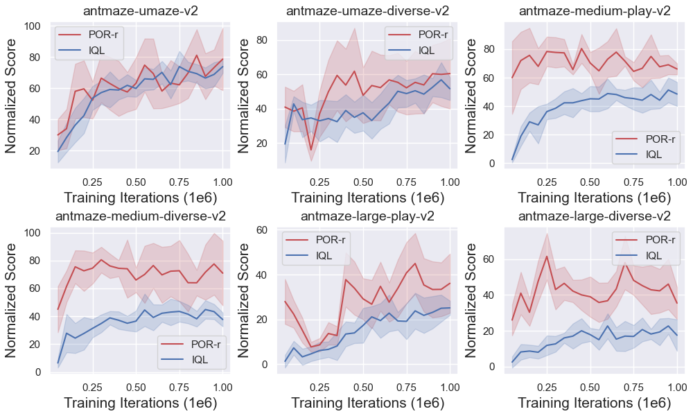

# A Policy-Guided Imitation Approach for Offline Reinforcement Learning

This is the code for reproducing the results of the paper A Policy-Guided Imitation Approach for Offline Reinforcement Learning accepted as **oral** at NeurIPS'2022. The paper and slide can be found at [paper](https://arxiv.org/abs/2210.08323) and [slide](https://docs.google.com/presentation/d/1swZTLDSvZLGCrXs46tzSHLWZC6VfO9qYChegjjadCpc/edit#slide=id.g170ea50d4c3_9_42).

Paper results were collected with [MuJoCo 1.50](http://www.mujoco.org/) (and [mujoco-py 1.50.1.1](https://github.com/openai/mujoco-py)) in [OpenAI gym 0.17.0](https://github.com/openai/gym) with the [D4RL datasets](https://github.com/rail-berkeley/d4rl). Networks are trained using [PyTorch 1.4.0](https://github.com/pytorch/pytorch) and Python 3.6.

Policy-guided Offline RL (POR) is a new offline RL paradigm, it enables **state-stitching** from the dataset rather than **action-stitching** as conducted in prior offline RL methods. POR enjoys training stability by using *in-sample* learning while still allowing logical *out-of-sample* generalization.
We hope that POR could shed light on how to enable state-stitching in offline RL, which connects well to goal-conditioned RL and hierarchical RL. 

To more clearly see the benefits of state-stitching over action-stitching, we reimplement IQL using our codebase and compare a variant of POR, namely POR-r (using the residual of value function as the weight to learn the guide-policy and the execute-policy by weighted BC) vs IQL. We use the same network sizes and hyperparameter ($\tau$). It is shown below that POR-r outperforms IQL, sometimes by a large margin.




### Bibtex
```
@inproceedings{xu2022policyguided,
  title  = {A Policy-Guided Imitation Approach for Offline Reinforcement Learning},
  author = {Haoran Xu and Li Jiang and Jianxiong Li and Xianyuan Zhan},
  year   = {2022},
  booktitle = {Advances in Neural Information Processing Systems},
}
```

